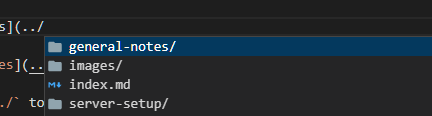

Link to [server notes](../server-setup/server_setup.md)

In VS Code type `(../` to bring up pop-up and navigate to file for internal link...


Top MkDocs extensions  
https://chrieke.medium.com/the-best-mkdocs-plugins-and-customizations-fc820eb19759

PyMdown Extensions  
https://facelessuser.github.io/pymdown-extensions/extensions/arithmatex/

:smile:

Add some recommended extensions using the full path:
``` yaml
--8<-- "mkdocs.yml"
```
Add some triggerscript:
``` bash
--8<-- "docs/triggerscript.sh"
```

List of markdown options  
https://squidfunk.github.io/mkdocs-material/reference/

List of markdown extensions (NB not all supported by Material for MkDocs)
https://squidfunk.github.io/mkdocs-material/setup/extensions/python-markdown-extensions/

To highlight codeblocks, enclose them in triple backwards quotes and also use https://pygments.org/docs/lexers/ to give the language at the start and add `linenums="1"` if you want to add line numbers:
```` markdown
``` bash linenums="1"
cd newdir
```
````

First Header  | Second Header
------------- | -------------
Content Cell  | Content Cell
Content Cell  | Content Cell

Test change

This page was last updated: *{{ git_revision_date_localized }}*  
This site was last updated: *{{ git_site_revision_date_localized }}*

Handy markdown cheatsheet: https://yakworks.github.io/docmark/cheat-sheet/
Tutorial: https://commonmark.org/help/tutorial/