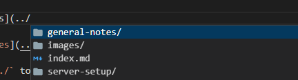

Link to [server notes](../server-setup/server_setup.md)

In VS Code type `(../` to bring up pop-up and navigate to file for internal link...


Top MkDocs extensions  
https://chrieke.medium.com/the-best-mkdocs-plugins-and-customizations-fc820eb19759

PyMdown Extensions  
https://facelessuser.github.io/pymdown-extensions/extensions/arithmatex/

Test git link clinicalit/ekora!33

:smile:
:fontawesome-solid-terminal:

Add some recommended extensions using the full path:
``` yaml
--8<-- "mkdocs.yml"
```
Add some triggerscript:
``` bash
--8<-- "docs/triggerscript.sh"
```

List of markdown options  
https://squidfunk.github.io/mkdocs-material/reference/

List of markdown extensions (NB not all supported by Material for MkDocs)
https://squidfunk.github.io/mkdocs-material/setup/extensions/python-markdown-extensions/

To highlight codeblocks, enclose them in triple backwards quotes and also use https://pygments.org/docs/lexers/ to give the language at the start and add `linenums="1"` if you want to add line numbers:
```` markdown
``` bash linenums="1"
cd newdir
```
````

First Header  | Second Header
------------- | -------------
Content Cell  | Content Cell
Content Cell  | Content Cell

Test change

This page was last updated: *{{ git_revision_date_localized }}*  
This site was last updated: *{{ git_site_revision_date_localized }}*

Handy markdown cheatsheet: https://yakworks.github.io/docmark/cheat-sheet/
Tutorial: https://commonmark.org/help/tutorial/

1. Set the `jwt_secret` with a 128-bit key (e.g. from https://www.allkeysgenerator.com/Random/Security-Encryption-Key-Generator.aspx)
1. Set the `default_redirection_url` with the one for this domain
1. Under `access_control` set the policy for different subdomains (options: bypass/one_factor/two_factor). Useful IBRACORP [guide](https://docs.ibracorp.io/authelia/authelia/rules) and [video](https://youtu.be/IWNypK2WxB0?t=1244) to rules
1. Under `session` set another random 128-bit key for the `secret` and change the `domain` to the main domain name (i.e. no subdomains)