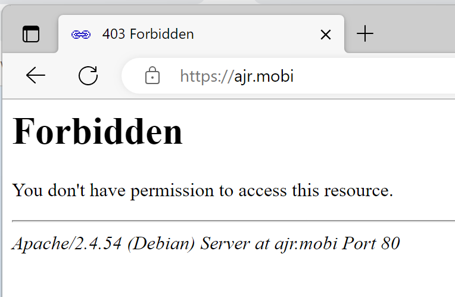

# Docker setup
## Docker
[Docker](https://www.docker.com/) is the definitive containerisation system for running applications.
!!! quote "From https://docs.docker.com/engine/install/debian/"
    ``` bash
    sudo curl -sSL https://get.docker.com/ | sh
    ```
!!! quote "Enable non-root access to the Docker daemon"
    ``` bash
    sudo usermod -aG docker <username>
    ```
    (need to logout and back in for this to become active)

## Portainer
[Portainer](https://www.portainer.io/) is a powerful GUI for managing Docker containers.

Create Portainer volume and then start Docker container, but for security bind port only to localhost, so that it cannot be accessed remotely except via an SSH tunnel.
!!! quote "Create portainer container"
    ``` bash
    docker run -d -p 127.0.0.1:8000:8000 -p 127.0.0.1:9000:9000 \
    --name=portainer --restart=always -v /var/run/docker.sock:/var/run/docker.sock \
    -v /home/alan/containers/portainer:/data portainer/portainer-ce:latest
    ```
<!-- Possible route to use Wireguard https://www.portainer.io/blog/how-to-run-portainer-behind-a-wireguard-vpn -->

Setup SSH tunnel - example SSH connection string
!!! quote "SSH tunnel"
    ``` bash
    ssh -L 9000:127.0.0.1:9000 <user>@<server.FQDN> -i <PATH-TO-PRIVATE-KEY>
    ```
    Then connect using http://localhost:9000

Go to Environments > local and add public IP to allow all the ports links to be clickable

Aim to put volumes in `~/containers/[containername]` for consistency.

## Watchtower
[Watchtower](https://containrrr.dev/watchtower/) is a container-based solution for automating Docker container base image updates.  
!!! tip "Initial docker config setup"
    Watchtower can pull from public repositories but to link to a private Docker Hub you need to supply login credentials.  This is best achieved by running a `docker login` command in the terminal, which will create a file in `$HOME/.docker/config.json` that we can then link as a volume to the Watchtower container.  If this is not done prior to running the container then Docker will instead create the `config.json` file as a directory!

    If 2FA enabled on Docker account then go to https://hub.docker.com/settings/security?generateToken=true to setup the access token

    The configuration below links to this config file and also links to the local time and tells Watchtower to include stopped containers and verbose logging.

!!! warning
    Remember to change the email settings below

=== "docker run"
    ???+ quote "bash"
        ``` bash
        docker run --detach \
            --name watchtower \
            --volume /var/run/docker.sock:/var/run/docker.sock \
            --volume $HOME/.docker/config.json:/config.json \
            -v /etc/localtime:/etc/localtime:ro \
            -e WATCHTOWER_NOTIFICATIONS=email
            -e WATCHTOWER_NOTIFICATIONS_HOSTNAME=<hostname>
            -e WATCHTOWER_NOTIFICATION_EMAIL_TO=<target email>
            -e WATCHTOWER_NOTIFICATION_EMAIL_SERVER_PASSWORD=<password>
            -e WATCHTOWER_NOTIFICATION_EMAIL_DELAY=2
            -e WATCHTOWER_NOTIFICATION_EMAIL_FROM=<sending email>
            -e WATCHTOWER_NOTIFICATION_EMAIL_SERVER=<mailserver>
            -e WATCHTOWER_NOTIFICATION_EMAIL_SERVER_PORT=587
            -e WATCHTOWER_NOTIFICATION_EMAIL_SERVER_USER=<maillogin>
            containrrr/watchtower --include-stopped --debug
        ```
=== "docker-compose (Portainer stack)"
    ???+ example "docker-compose/watchtower.yml" 
        ``` yaml linenums="1"
        --8<-- "docs/server-setup/docker-compose/watchtower.yml"
        ```
!!! tip "Run frequency"
    By default Watchtower runs once per day, with the first run 24h after container activation.  This can be adjusted by passing the `--interval` [command](https://containrrr.dev/watchtower/arguments/#poll_interval) and specifying the number of seconds. There is also the option of using the `--run-once` flag to immediately check all containers and then stop Watchtower running.
!!! info "Private Docker Hub images"
    Ensure any private docker images have been started as `index.docker.io/<user>/main:tag` rather than `<user>/main:tag`
!!! tip "Exclude containers"
    To exclude a container from being checked it needs to be built with a label set in the docker-compose to tell Watchtower to ignore it
    ``` yaml
    labels:
      - "com.centurylinklabs.watchtower.enable=false"
    ```

## Nginx Proxy Manager
[Nginx Proxy Manager](https://nginxproxymanager.com) lets private containerised applications run via secure HTTPS proxies (including free Let's Encrypt SSL certificates).

Apply this docker-compose (based on https://nginxproxymanager.com/setup/#running-the-app) as a stack in Portainer to deploy: 
??? example "docker-compose/nginx-proxy-manager.yml"
    ``` yaml linenums="1"
    --8<-- "docs/server-setup/docker-compose/nginx-proxy-manager.yml"
    ```

Login to the admin console at `<serverIP>:81` with email `admin@example.com` and password `changeme`. Then change user email/password combo.

Setup new proxy host for NPM itself with scheme `http`, forward hostname of `localhost` and forward port of `81`.
!!! info "Force SSL access to admin interface"
    Once initial setup is completed, change & reload the NPM stack in Portainer to comment out port 81 so that access to admin interface is only via SSL.

Remember to change the Default Site in NPM settings for appropriate redirections for invalid subdomain requests.

??? info "Certbot errors on certificate renewal"
    If there is an error re a duplicate instance, check whether there are .certbot.lock files in your system.
    ``` bash
    find / -type f -name ".certbot.lock"
    ```
    If there are, you can remove them:
    ``` bash
    find / -type f -name ".certbot.lock" -exec rm {} \;
    ```
    From https://community.letsencrypt.org/t/solved-another-instance-of-certbot-is-already-running/44690/2

## Dozzle
Nice logviewer application that lets you monitor all the container logs - https://dozzle.dev/

Apply this docker-compose as a stack in Portainer to deploy:
??? example "docker-compose/dozzle.yml"
    ``` yaml linenums="1"
    --8<-- "docs/server-setup/docker-compose/dozzle.yml"
    ```
Add to nginx proxy manager as usual (forward hostname `dozzle` and port `8080`), but with the addition of `proxy_read_timeout 30m;` in the advanced settings tab to minimise the issue of the default 60s proxy timeout causing [repeat log entries](https://github.com/amir20/dozzle/issues/1404).

## Filebrowser
A nice GUI file browser - https://github.com/filebrowser/filebrowser

!!! warning "Create the empty db first"
    ``` bash
    mkdir -p $HOME/containers/filebrowser/branding && touch $HOME/containers/filebrowser/filebrowser.db
    ```

Then install via docker-compose:
??? example "docker-compose/filebrowser.yml" 
    ``` yaml linenums="1"
    --8<-- "docs/server-setup/docker-compose/filebrowser.yml"
    ```

Then setup NPM SSH reverse proxy (remember to include websocket support, with forward hostname `filebrowser` and port `80`) and then login:
!!! info "Default credentials"
    Username: `admin`  
    Password: `admin`

{ align=right } To customise the appearance change the instance name (e.g., `Deployment server`) and set the branding directory path (e.g., `/branding`) in Settings > Global Settings.  Then create `img` and `img/icons` directories in the previously created `containers/filebrowser/branding` directory and add the `logo.svg`  and `favicon.ico` and 16x16 and 32x32 PNGs (if you only do the `.ico`) then the browser will pick the internal higher resolution PNGs.
{ align=right }  

!!! tip "Generating favicons"
    The [favicon generator](https://realfavicongenerator.net/) is a very useful website to generate all the required favicons for different platforms.

## Optional containers
### Uptime Kuma monitoring
A nice status monitoring app - https://github.com/louislam/uptime-kuma

Install via docker-compose:
??? example "docker-compose/uptime-kuma.yml" 
    ``` yaml linenums="1"
    --8<-- "docs/server-setup/docker-compose/uptime-kuma.yml"
    ```

???+ tip "Join to bridge network post setup if required"
    Remember docker-compose can only join the new container to one network, so need to manually add to bridge network afterwards if you also want to monitor containers that aren't on the `nginx-proxy-manager_default` network so use the following command (or add network via Portainer):  
    ``` bash
    docker network connect bridge uptime-kuma
    ```

### NextCloud
Cloud-hosted sharing & collaboration server - https://hub.docker.com/r/linuxserver/nextcloud and https://nextcloud.com/

Install via docker-compose:
??? example "docker-compose/nextcloud.yml - remember to change host directories if required" 
    ``` yaml linenums="1"
    --8<-- "docs/server-setup/docker-compose/nextcloud.yml"
    ```
The setup NPM SSH reverse proxy to https port 443 and navigate to new site to setup login.

!!! info "Setup 2FA"
    After login go to User > Settings > Security (Administration section) > Enforce two-factor authentication.  
    Then go User > Apps > Two-Factor TOTP Provider (https://apps.nextcloud.com/apps/twofactor_totp) *or just click on search icon at the top right and type in TOTP*  
    Then go back to User > Settings > Security (Personal section) > Tick 'Enable TOTP' and verify the code

### Glances 
System monitoring tool - https://nicolargo.github.io/glances/

Install via docker-compose:
??? example "docker-compose/glances.yml" 
    ``` yaml linenums="1"
    --8<-- "docs/server-setup/docker-compose/glances.yml"
    ```
Then setup NPM SSH reverse proxy to https port 443 and navigate to the new site to setup login.

### Webtop
'Linux in a web browser' https://github.com/linuxserver/docker-webtop

Install via docker-compose:
??? example "docker-compose/webtop.yml" 
    ``` yaml linenums="1"
    --8<-- "docs/server-setup/docker-compose/webtop.yml"
    ```
Then setup NPM SSH reverse proxy to port 3000 and navigate to the new site.

### MeshCentral
Self-hosted remote access client - https://github.com/Ylianst/MeshCentral & https://meshcentral.com/info/

Install via docker-compose:
??? example "docker-compose/meshcentral.yml" 
    ``` yaml linenums="1"
    --8<-- "docs/server-setup/docker-compose/meshcentral.yml"
    ```

See NGINX section of the [user guide](https://meshcentral.com/info/docs/MeshCentral2UserGuide.pdf) (p34 onwards) for more information about configuring to run alongside NPM, however the key thing to note that **a fixed IP address needs to be specified in the docker-compose file for NPM** - as an example in the docker-compose sample file on this site is set to `172.19.0.100`.  The MeshCentral configuration file needs to reflect this accordingly. If this is not done the NPM container will be auto-allocated a new IP when it is re-created (e.g., for when there is an update) and MeshCentral then will run into SSL errors as it can't validate the certificate that has been passed through...
??? info "Log error with IP mismatch with configuration."
    ```
    02/25/2023 2:52:11 PM
    Installing otplib@10.2.3...
    02/25/2023 2:52:25 PM
    MeshCentral HTTP redirection server running on port 80.
    02/25/2023 2:52:25 PM
    MeshCentral v1.1.4, WAN mode, Production mode.
    02/25/2023 2:52:27 PM
    MeshCentral Intel(R) AMT server running on remote.alanjrobertson.co.uk:4433.
    02/25/2023 2:52:27 PM
    Failed to load web certificate at: "https://172.19.0.14:443/", host: "remote.alanjrobertson.co.uk"
    02/25/2023 2:52:27 PM
    MeshCentral HTTP server running on port 4430, alias port 443.
    02/25/2023 2:52:48 PM
    Agent bad web cert hash (Agent:68db80180d != Server:c68725feb5 or 9259b83292), holding connection (172.19.0.11:44332).
    02/25/2023 2:52:48 PM
    Agent reported web cert hash:68db80180d05fce0032a326259b825c76f036593c62a8be0346365eb5540a395dbfae31d8cade3f2a4370c29c2563c27.
    02/25/2023 2:52:48 PM
    Failed to load web certificate at: "https://172.19.0.14:443/", host: "remote.alanjrobertson.co.uk"
    02/25/2023 2:52:48 PM
    Agent bad web cert hash (Agent:68db80180d != Server:c68725feb5 or 9259b83292), holding connection (172.19.0.11:44344).
    02/25/2023 2:52:48 PM
    Agent reported web cert hash:68db80180d05fce0032a326259b825c76f036593c62a8be0346365eb5540a395dbfae31d8cade3f2a4370c29c2563c27.
    02/25/2023 2:53:18 PM
    Agent bad web cert hash (Agent:68db80180d != Server:c68725feb5 or 9259b83292), holding connection (172.19.0.11:52098).
    02/25/2023 2:53:18 PM
    Agent reported web cert hash:68db80180d05fce0032a326259b825c76f036593c62a8be0346365eb5540a395dbfae31d8cade3f2a4370c29c2563c27.
    02/25/2023 2:54:03 PM
    Agent bad web cert hash (Agent:68db80180d != Server:c68725feb5 or 9259b83292), holding connection (172.19.0.11:53218).
    02/25/2023 2:54:03 PM
    Agent reported web cert hash:68db80180d05fce0032a326259b825c76f036593c62a8be0346365eb5540a395dbfae31d8cade3f2a4370c29c2563c27.
    ```

Edit `~/containers/meshcentral/data/config.json` to replace with the following. Remember that items beginning with an underscore are ignored.
??? example "config.json - remember to edit highlighted lines to ensure the correct FQDN and NPM host are specified" 
    ``` json linenums="1" hl_lines="4 12 21"
    --8<-- "docs/server-setup/config/meshcentral/config.json"
    ```
Then setup NPM SSH reverse proxy to port 4430 (**remember to switch on websocket support**) and navigate to the new site.

If running with Authelia then add new entries into the configuration file there too so that the agent and (for remote control) the meshrelay and (for setup of the agents and settings) the invite download page can all bypass the authentication but that the main web UI is under two factor:  
``` yaml
    - domain: remote.alanjrobertson.co.uk
      resources:
        # allow agent & agent invites to bypass
        - "^/agent.ashx([?].*)?$"
        - "^/agentinvite([?].*)?$"
        # allow mesh relay to bypass (for remote control, console, files) and agents to connect/obtain settings
        - "^/meshrelay.ashx([?].*)?$"
        - "^/meshagents([?].*)?$"
        - "^/meshsettings([?].*)?$"
        # allow files to be downloaded
        - "^/devicefile.ashx([?].*)?$"
        # allow invite page for agent download to be displayed
        - "^/images([/].*)?$"
        - "^/scripts([/].*)?$"
        - "^/styles([/].*)?$"
      policy: bypass
    - domain: remote.alanjrobertson.co.uk
      policy: two_factor
```      
See [Authelia documentation](https://www.authelia.com/configuration/security/access-control/#resources) for more on regex string (and use [Regex 101](https://regex101.com/) with `Golang` option)

Login to MeshCentral and set up an initial account. Then add a new group and download and install the agent.  Once installed you will see it show up in MeshCentral and will be able to control/access remotely.  There is also the option to download an Assistant (that can be branded) that users can then run once (doesn't require elevated privileges; also can run the Assistant with `-debug` flag to log if any issues).

To setup custom images for hosts, run the following commands:
``` bash
docker exec -it meshcentral /bin/bash
cp -r public/ /opt/meshcentral/meshcentral-web/
cp -r views/ /opt/meshcentral/meshcentral-web/
```
Then change the relevant icons - create a 256x256 PNG with a transparent background and replace some existing icons. This will change the large icons but not the small ones (see [Github bug](https://github.com/Ylianst/MeshCentral/issues/448#issuecomment-1364731041))

!!! warning "Add AV exception"
    It is like an exception needs to be added to AV software for `C:\Program Files\Mesh Agent` on the local machine (certainly is the case with Avast).

### Netdata 
System monitoring tool - https://www.netdata.cloud/

Install via docker-compose:
??? example "docker-compose/netdata.yml" 
    ``` yaml linenums="1"
    --8<-- "docs/server-setup/docker-compose/netdata.yml"
    ```
The setup NPM SSH reverse proxy to https port 443 and navigate to new site to view login. Also option of linking to online account - need to get login token from website and change stack to include this in the environment variables.

### YOURLS
Link shortner tool with personal tracking - https://yourls.org

Install via docker-compose:
??? example "docker-compose/yourls.yml" 
    ``` yaml linenums="1" hl_lines="11 13 29-31"
    --8<-- "docs/server-setup/docker-compose/yourls.yml"
    ```

Copy my.cnf file contents to `~/containers/yourls/my.cnf` - this reduces RAM usage from ~233MB down to 44MB
??? example "~/containers/yourls/my.cnf" 
    ``` config
    --8<-- "docs/server-setup/config/yourls/my.cnf"
    ```

Add any plugins to subdirectories within `~/containers/yourls/plugins` - see [preview](https://yourls.org/docs/development/examples/preview) and [qrcode](https://yourls.org/docs/development/examples/qrcode) as examples (although [Preview URL with QR code](https://github.com/DennyDai/yourls-preview-url-with-qrcode) is a nicer option than the preview only one).  Then go to the admin interface (`domain.tld/admin`) and on the plugins page activate the newly installed plugins.

By default accessing the root directory (`domain.tld`) or an incorrect shortcode will display a 403 error page. Place an index.(html|php) file in the `~/containers/yourls/html` directory of the host (volume is already mapped in the stack/docker-compose file) to replace this. 

??? example "example index.html with background image and centred text" 
    ``` html
    --8<-- "docs/server-setup/config/yourls/index.html"
    ```
    (image-centering CCS from https://css-tricks.com/perfect-full-page-background-image/)

You can change the favourites icon in the browser tab by adding `favicon.ico` to `~/containers/yourls/html` - a nice generator for these is at https://gauger.io/fonticon/.

Note that after installation the root directory will just show an error - this is by design. Go to `/admin` to access the admin interface. Click to setup database then login using the credentials included in the docker-compose file.


### Homepage options 

=== "Homer"
    https://github.com/bastienwirtz/homer
    !!! warning "Create the empty assets folder first"
        ``` bash
        mkdir -p $HOME/containers/homer/assets
        ```

    Install via docker-compose (stack on Portainer):
    ??? example "docker-compose/homer.yml" 
        ``` yaml linenums="1"
        --8<-- "docs/server-setup/docker-compose/homer.yml"
        ```

=== "Heimdall"
    https://github.com/linuxserver/Heimdall

    Install via docker-compose (stack on Portainer):
    ??? example "docker-compose/heimdall.yml" 
        ``` yaml linenums="1"
        --8<-- "docs/server-setup/docker-compose/heimdall.yml"
        ```
    !!! warning "Fix max image size issue by increasing default PHP 2MB limit"
        ``` bash
        echo "upload_max_filesize = 30M" >> /home/alan/containers/heimdall/php/php-local.ini
        ```
        
=== "Dashy"        
    https://github.com/Lissy93/dashy

    !!! danger "DO NOT USE IF RAM <1GB"
        Build fails unless higher RAM levels, leading to high CPU and swap usage.  
        See discussion at https://github.com/Lissy93/dashy/issues/136

    !!! warning "Create the empty db file first"
        ``` bash title=":fontawesome-solid-terminal: bash"
        mkdir -p $HOME/containers/dashy && touch $HOME/containers/dashy/my-conf.yml
        ```

    Install via docker-compose (stack on Portainer):
    ??? example "docker-compose/dashy.yml" 
        ``` yaml linenums="1"
        --8<-- "docs/server-setup/docker-compose/dashy.yml"
        ```    

### Matomo 
Self-hosted analytics platform - https://matomo.org/  
Install via docker-compose (stack on Portainer):
??? example "docker-compose/matomo.yml" 
    ``` yaml linenums="1" hl_lines="9 10 26 27"
    --8<-- "docs/server-setup/docker-compose/matomo.yml"
    ```
Then setup in NPM as usual with SSL and add the usual [Authelia container advanced config](authelia_setup.md#nginx-proxy-manager-setup).  
Once this is done access Matomo via the new proxy address and follow the click-through setup steps. Database parameters should already be pre-filled (from the environment variables above), the main step is just to setup a superadmin user. After this the setup process will generate the tracking code that has to be placed just before the closing `</head>` tag (or in the relevant Wordpress configuration).  This tracking code needs to be able to access the `matomo.php` and `matomo.js` files without authentication, so the following has to be added to the Authelia configuration:

??? example "add to `access_control` section of ~/containers/authelia/config/configuration.yml"
    ``` yml
        - domain: analytics.alanjrobertson.co.uk
        resources:
            - "^matomo.php*$"
            - "^matomo.js*$"
        policy: bypass
    ```


## Docker Compose files for existing containers
It is possible to easily generate a Docker Compose file for a container that has been started via the command line - see https://github.com/Red5d/docker-autocompose

=== "Specific container(s)"
    ``` bash
    docker run --rm --pull always \
        -v /var/run/docker.sock:/var/run/docker.sock \
        ghcr.io/red5d/docker-autocompose \
        <container-name-or-id> <additional-names-or-ids>
    ```

=== "All containers"
    ``` bash
    docker run --rm --pull always \
        -v /var/run/docker.sock:/var/run/docker.sock \
        ghcr.io/red5d/docker-autocompose \
        $(docker ps -aq)
    ```
