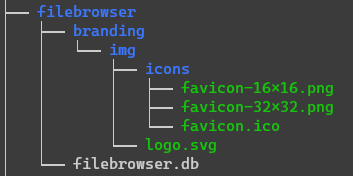
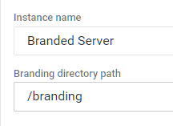

# Docker & Portainer setup
!!! info "Container options"
    In general aim to use Alpine Linux-based containers to minimise size/bloat of the underlying container.

See https://docs.docker.com/engine/install/debian/
`sudo curl -sSL https://get.docker.com/ | sh`
To enable non-root access to the Docker daemon run `sudo usermod -aG docker <username>` - then logout and back in

Create Portainer volume and then start Docker container, but for security bind port only to localhost, so that it cannot be access except when an SSH tunnel is active.
``` bash
docker volume create portainer_data
docker run -d -p 127.0.0.1:8000:8000 -p 127.0.0.1:9000:9000 \
 --name=portainer --restart=always -v /var/run/docker.sock:/var/run/docker.sock \
 -v portainer_data:/data portainer/portainer-ce:latest
```
Possible route to use Wireguard https://www.portainer.io/blog/how-to-run-portainer-behind-a-wireguard-vpn

SSH tunnel - example SSH connection string
``` bash
ssh -L 9000:127.0.0.1:9000 <user>@<server FQDN> -i <PATH TO PRIVATE KEY>
```
Then connect using http://localhost:9000

Go to Environments > local and add public IP to allow all the ports links to be clickable

Aim to put volumes in /var/lib/docker/volums/[containername]
Use bind for nginx live website so can easily be updated from script

### Watchtower setup - monitor and update Docker containers
[Watchtower](https://containrrr.dev/watchtower/) is a container-based solution for automating Docker container base image updates.  
It can pull from public repositories but to link to a private Docker Hub you need to supply login credentials.  This is best achieved by running a `docker login` command in the terminal, whith will create a file in `$HOME/.docker/config.json` that we can then link as a volume to the Watchtower container.  
The configuration below links to this config file and also links to the local time and tells Watchtower to include stopped containers and verbose logging.
=== "docker run"
    ???+ quote "bash"
        ``` bash
        docker run --detach \
            --name watchtower \
            --volume /var/run/docker.sock:/var/run/docker.sock \
            --volume $HOME/.docker/config.json:/config.json \
            -v /etc/localtime:/etc/localtime:ro \
            -e WATCHTOWER_NOTIFICATIONS=email
            -e WATCHTOWER_NOTIFICATIONS_HOSTNAME=<hostname>
            -e WATCHTOWER_NOTIFICATION_EMAIL_TO=<target email>
            -e WATCHTOWER_NOTIFICATION_EMAIL_SERVER_PASSWORD=<password>
            -e WATCHTOWER_NOTIFICATION_EMAIL_DELAY=2
            -e WATCHTOWER_NOTIFICATION_EMAIL_FROM=<sending email>
            -e WATCHTOWER_NOTIFICATION_EMAIL_SERVER=<mailserver>
            -e WATCHTOWER_NOTIFICATION_EMAIL_SERVER_PORT=587
            -e WATCHTOWER_NOTIFICATION_EMAIL_SERVER_USER=<maillogin>
            containrrr/watchtower --include-stopped --debug
        ```
=== "docker-compose (Portainer stack)"
    ???+ example "docker-compose/watchtower.yml" 
        ``` yaml linenums="1"
        --8<-- "docs/server-setup/docker-compose/watchtower.yml"
        ```
!!! tip "Run frequency"
    By default Watchtower runs once per day, with the first run 24h after container activation.  This can be adjusted by passing the `--interval` [command](https://containrrr.dev/watchtower/arguments/#poll_interval) and specifying the number of seconds. There is also the option of using the `--run-once` flag to immediately check all containers and then stop Watchtower running.
!!! info "Private Docker Hub images"
    Ensure any private docker images have been started as `index.docker.io/<user>/main:tag` rather than `<user>/main:tag`
!!! tip "Exclude containers"
    To exclude a container from being checked it needs to be built with a label set in the docker-compose to tell Watchtower to ignore it
    ``` yaml
    labels:
      - "com.centurylinklabs.watchtower.enable=false"
    ```

### NGINX Proxy Manager install
Apply this docker-compose (based on https://nginxproxymanager.com/setup/#running-the-app) as a stack in Portainer to deploy: 
??? example "docker-compose/nginx-proxy-manager.yml"
    ``` yaml linenums="1"
    --8<-- "docs/server-setup/docker-compose/nginx-proxy-manager.yml"
    ```

### Dozzle (log viewer) setup
Nice logviewer application that lets you monitor all the container logs - https://dozzle.dev/

Apply this docker-compose as a stack in Portainer to deploy:
??? example "docker-compose/dozzle.yml"
    ``` yaml linenums="1"
    --8<-- "docs/server-setup/docker-compose/dozzle.yml"
    ```
Add to nginx proxy manager as usual, but with the addition of `proxy_read_timeout 30m;` in the advanced settings tab to minimise the issue of the default 60s proxy timeout causing [repeat log entries](https://github.com/amir20/dozzle/issues/1404).

### Export existing container(s) as Docker Compose file(s)
From https://github.com/Red5d/docker-autocompose this will automatically generate docker compose files for specified containers:

``` bash
docker run --rm -v /var/run/docker.sock:/var/run/docker.sock ghcr.io/red5d/docker-autocompose <container-name-or-id> <additional-names-or-ids>
```

Or for all containers:
``` bash
docker run --rm -v /var/run/docker.sock:/var/run/docker.sock ghcr.io/red5d/docker-autocompose $(docker ps -aq)
```

### Uptime Kuma monitoring
A nice status monitoring app - https://github.com/louislam/uptime-kuma

Install it via docker-compose:
??? example "docker-compose/uptime-kuma.yml" 
    ``` yaml linenums="1"
    --8<-- "docs/server-setup/docker-compose/uptime-kuma.yml"
    ```

???+ tip "Join to bridge network post setup if required"
    Remember docker-compose can only join the new container to one network, so need to manually add to bridge network afterwards if you also want to monitor containers that aren't on the `nginx-proxy-manager_default` network so use the following command (or add network via Portainer):  
    ``` bash
    docker network connect bridge uptime-kuma
    ```

### Filebrowser
A nice GUI file browser - https://github.com/filebrowser/filebrowser

???+ warning "Create the empty db file first"
    ``` bash
    mkdir -p $HOME/containers/filebrowser && touch $HOME/containers/filebrowser/filebrowser.db
    ```

Then install via docker-compose:
??? example "docker-compose/filebrowser.yml" 
    ``` yaml linenums="1"
    --8<-- "docs/server-setup/docker-compose/filebrowser.yml"
    ```

Then setup NPM SSH reverse proxy (remember to include websocket support) and then login:
???+ info "Default credentials"
    Username: `admin`  
    Password: `admin`

{ align=right } To customise the appearance create `img` and `img/icons` directories in a subfolder of the `containers/filebrowser` directory (e.g., `customisation` or `branding`)
and add the `logo.svg`  and `favicon.ico` and 16x16 and 32x32 PNGs (if you only do the `.ico`) then the browser will pick the internal higher resolution PNGs.
{ align=right }  

???+ tip "Generating favicons"
    The [favicon generator](https://realfavicongenerator.net/) is a very useful website to generate all the required favicons for different platforms.

Then change the instance name and set the branding directory path in Settings > Global Settings (matching the one set in the docker-compose file above)

### NextCloud
Cloud-hosted sharing & collaboration server - https://hub.docker.com/r/linuxserver/nextcloud and https://nextcloud.com/

Then install via docker-compose:
??? example "docker-compose/nextcloud.yml - remember to change host directories if required" 
    ``` yaml linenums="1"
    --8<-- "docs/server-setup/docker-compose/nextcloud.yml"
    ```
The setup NPM SSH reverse proxy to https port 443 and navigate to new site to setup login.

???+ info "Setup 2FA"
    After login go to User > Settings > Security (Administration section) > Enforce two-factor authentication.  
    Then go User > Apps > Two-Factor TOTP Provider (https://apps.nextcloud.com/apps/twofactor_totp) *or just click on search icon at the top right and type in TOTP*  
    Then go back to User > Settings > Security (Personal section) > Tick 'Enable TOTP' and verify the code

### Homepage options

=== "Homer"
    https://github.com/bastienwirtz/homer
    !!! warning "Create the empty assets folder first"
        ``` bash
        mkdir -p $HOME/containers/homer/assets
        ```

    Then install via docker-compose (stack on Portainer):
    ??? example "docker-compose/homer.yml" 
        ``` yaml linenums="1"
        --8<-- "docs/server-setup/docker-compose/homer.yml"
        ```

=== "Heimdall"
    https://github.com/linuxserver/Heimdall

    Install via docker-compose (stack on Portainer):
    ??? example "docker-compose/heimdall.yml" 
        ``` yaml linenums="1"
        --8<-- "docs/server-setup/docker-compose/heimdall.yml"
        ```
    !!! warning "Fix max image size issue by increasing default PHP 2MB limit"
        ``` bash
        echo "upload_max_filesize = 30M" >> /home/alan/containers/heimdall/php/php-local.ini
        ```
        
=== "Dashy"        
    https://github.com/Lissy93/dashy

    !!! danger "DO NOT USE IF RAM <1GB"
        Build fails unless higher RAM levels, leading to high CPU and swap usage.  
        See discussion at https://github.com/Lissy93/dashy/issues/136

    !!! warning "Create the empty db file first"
        ``` bash title=":fontawesome-solid-terminal: bash"
        mkdir -p $HOME/containers/dashy && touch $HOME/containers/dashy/my-conf.yml
        ```

    Install via docker-compose (stack on Portainer):
    ??? example "docker-compose/dashy.yml" 
        ``` yaml linenums="1"
        --8<-- "docs/server-setup/docker-compose/dashy.yml"
        ```    