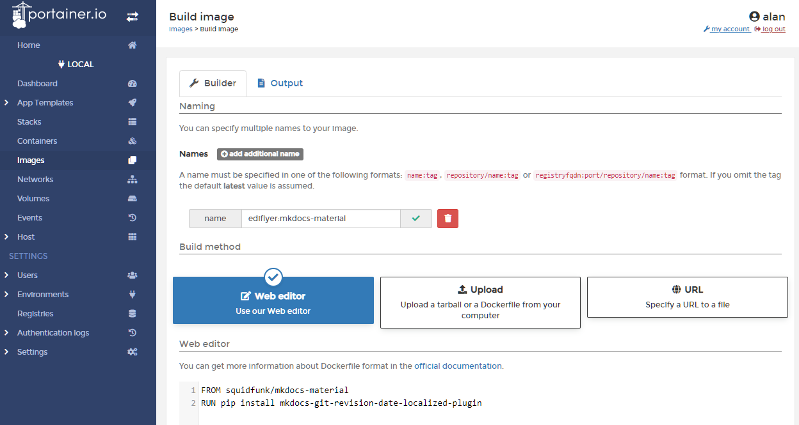

# Material for MkDocs setup
See [`triggerscript.sh`](../triggerscript.sh) for the build command for the deployed setup, however for testing changes live a persistent container serving mkdocs-material is much quicker and easier to use.

We want to use the [mkdocs-git-revision-date-localized plugin](https://github.com/timvink/mkdocs-git-revision-date-localized-plugin) and the [MkDocs GLightbox plugin](https://github.com/blueswen/mkdocs-glightbox) - these need to be installed by `pip` on top of the main `mkdocs-material` image, therefore we need to create a custom Dockerfile to add the revelant commands and create a custom image before we can activate them in the `mkdocs.yml` configuration file:
??? example "mkdocs.dockerfile - use in Portainer as Images > Build image"
    ``` docker linenums="1"
    FROM squidfunk/mkdocs-material
    RUN pip install mkdocs-git-revision-date-localized-plugin
    RUN pip install mkdocs-glightbox
    RUN pip install mkdocs-awesome-pages-plugin
    RUN git config --global --add safe.directory /docs
    ```
    Once we have created that file we can then either build the custom image using the following command:  
    ``` bash
    docker build --tag="custom/mkdocs-material" --file="mkdocs.dockerfile" .
    ```
    (the `.` at the end is important as it sets the build context and the command won't work without it!)  
    
    Or using Portainer we can just paste directly in as a custom image:  
    Name: `custom/mkdocs-material`
    

Now that the custom image has been created we can use a docker-compose file to create a stack in Portainer.  The benefit of having this as a stack as is that we can easily re-deploy it.

??? example "docker-compose/mkdocs-live.yml"
    ``` yaml linenums="1"
    --8<-- "docs/server-setup/docker-compose/mkdocs-live.yml"
    ```

However as we have created a custom image we also need to create a stopped container using the standard image so we will be notified by Watchtower if it detects and update and thus we can redeploy the live mkdocs stack (the deployment one isn't running but will use the latest image too)

??? example "docker-compose/mkdocs-checkforupdates.yml"
    ``` yaml linenums="1"
    --8<-- "docs/server-setup/docker-compose/mkdocs-checkforupdates.yml"
    ```

## Docker compose file for mkdocs-material with date plugin
FROM squidfunk/mkdocs-material
RUN pip install mkdocs-git-revision-date-localized-plugin
RUN git config --global --add safe.directory /docs

<!-- ## Hugo installation
Download latest Hugo version from `https://github.com/gohugoio/hugo/releases` and copy to `/usr/local/bin`

Create new Hugo site in the repository
```
cd repositories
hugo new site --force <repo name>/
```

Add the following to .gitignore
```
nano <repo name>/.gitignore

public/
```

Add theme
```
cd <reponame>
git submodule add https://github.com/McShelby/hugo-theme-relearn.git themes/hugo-theme-relearn
```

Edit `config.toml`
# Change the default theme to be use when building the site with Hugo
theme = "hugo-theme-relearn" -->

### Logo/Favicon setup
Place desired PNG/SVG logo and `favicon.ico` in `docs/images`.

See https://realfavicongenerator.net/ to generate a favicon from a logo.

### NGINX install
When deploying container, **be sure to set network to nginx-proxy-manager_default**. Also bind /usr/share/nginx/html on the container to /var/www/<sitename>/html on the host

In NPM add proxy host - enter subdomain.domain.tld then redirect to docker container name on relevant port

<!-- ### Setup site on NGINX
Add the following line to the http block of /etc/nginx/nginx.conf to disable version info
server_tokens off;

Create /var/www/<sitename.domain.tld>/html
`cd /etc/nginx/conf.d`
`sudo mv default.conf default.conf.disabled`
`sudo cp default.conf <sitename.domain.tld>.conf`
edit server_name and change to FQDN
change locations to /var/www/<sitename.domain.tld>/html
different locations (e.g. /blog/) can redirect to different servers on the folder.

Check config and reload
`sudo nginx -t && sudo nginx -s reload`

## SSL/TLS setup
```
sudo apt install snapd
sudo snap install core
sudo snap install --classic certbot
sudo ln -s /snap/bin/certbot /usr/bin/certbot
sudo certbot --nginx
```

to test cert renewal
`sudo certbot renew --dry-run`
(see https://certbot.eff.org/instructions?ws=nginx&os=debianbuster for explanation of terminology) -->