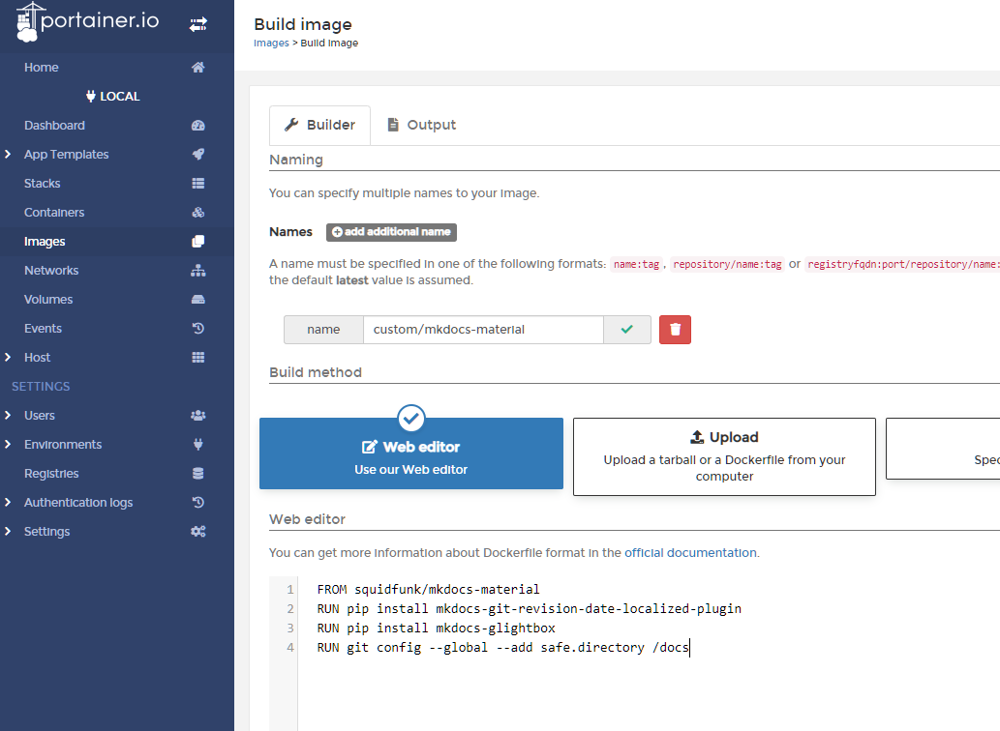

# Material for MkDocs setup
### Create a live container
A script is used to run for the build command for the deployed setup, however for testing changes live a persistent container serving mkdocs-material is much quicker and easier to use as changes are displayed instantly (esp if editing using SSH Remote connection in VS Code).

To enhance the documentation site plugins are used to extend the functionality of Material for MkDocs.  The main ones used in the case of this site are:

- [mkdocs-git-revision-date-localized plugin](https://github.com/timvink/mkdocs-git-revision-date-localized-plugin)
- [mkdocs-glightbox plugin](https://github.com/blueswen/mkdocs-glightbox)
- [mkdocs-awesome-pages plugin](https://github.com/lukasgeiter/mkdocs-awesome-pages-plugin)

These need to be installed by `pip` on top of the main `mkdocs-material` image, therefore a custom Dockerfile is needed to add the relevant colour commands and create a custom image before they can be activated in the `mkdocs.yml` configuration file:

??? example "mkdocs.dockerfile - use in Portainer as Images > Build image"
    <a name="instructions"></a>
    ``` docker linenums="1"
    FROM squidfunk/mkdocs-material
    RUN pip install mkdocs-git-revision-date-localized-plugin
    RUN pip install mkdocs-glightbox
    RUN pip install mkdocs-awesome-pages-plugin
    RUN git config --global --add safe.directory /docs
    ```
    Once this dockerfile has been created the custom image can be built either using `docker build` or Portainer:  
    === "docker build"
        ``` bash
        docker build --pull --tag="custom/mkdocs-material" --file="mkdocs.dockerfile" .
        ```
        The `.` at the end is important as it sets the build context and the command won't work without it!
        
        !!! hint "docker build known issue"
            Docker build scans the whole directory structure therefore rather than placing the dockerfile in the home directory, place instead in an empty subdirectory (e.g., `dockerfiles`), otherwise you will receive an error saying "`error checking context: 'no permission to read from [folder xyz]'`"

    === "Portainer"
        The above text can be pasted directly in as a custom image:  
        Name: `custom/mkdocs-material`
        

Now that the custom image has been created above, a docker-compose file may be used to create a stack in Portainer.  The benefit of having this as a stack as is that it can easily be re-deployed, for example when the underlying image has been updated with a new plugin or a new version.

??? example "docker-compose/mkdocs-live.yml"
    ``` yaml linenums="1" hl_lines="19"
    --8<-- "docs/server-setup/docker-compose/mkdocs-live.yml"
    ```

However as a custom image is now in use the Watchtower system will not be able to monitor it (as it has nothing to compare it to).  It is therefore necessary to create a (stopped) container using the standard image that can be monitored by Watchtower.  When the update email mentions an update to this image a new custom image can then be rebuilt and deployed.

??? example "docker-compose/mkdocs-checkforupdates.yml"
    ``` yaml linenums="1"
    --8<-- "docs/server-setup/docker-compose/mkdocs-checkforupdates.yml"
    ```

### Updating the custom image
!!! tip "How to check the installed version of mkdocs-material (e.g. to ensure a custom image has updated)"
    ``` bash
    docker exec -it mkdocs-live pip3 show mkdocs-material
    ```

When a new version is released the following steps need to be undertaken to update the custom image:

1. Rebuild the custom container [(see instructions above)](#instructions) or run [`mkdocs-update.sh`](/docs/server-setup/scripts/mkdocs-update.sh) after ensuring the dockerfile is in the same directory
2. Redeploy the `mkdocs-live` stack (so that it switches to use this updated container, otherwise it will continue to use the old one) - **do not tick the 're-pull' image option as the image is stored locally, not on dockerhub**.  _NB If the `mkdocs-checkforupdates` container wasn't updated by Watchtower then this will also need to be updated_
3. Remove the old image (this will now be untagged in the image list as the tag transferred to the new custom image and will also now show as unused. Prior to step #2 this would still be used by the mkdocs-live container)

### New site
If creating a new site then use the command via Docker to create a new empty set of template files:
!!! quote "New site"
    ``` bash
    docker run --rm -it -v ${PWD}:/docs squidfunk/mkdocs-material new .
    ```


<!-- ## Hugo installation
Download latest Hugo version from `https://github.com/gohugoio/hugo/releases` and copy to `/usr/local/bin`

Create new Hugo site in the repository
```
cd repositories
hugo new site --force <repo name>/
```

Add the following to .gitignore
```
nano <repo name>/.gitignore

public/
```

Add theme
```
cd <reponame>
git submodule add https://github.com/McShelby/hugo-theme-relearn.git themes/hugo-theme-relearn
```

Edit `config.toml`
# Change the default theme to be use when building the site with Hugo
theme = "hugo-theme-relearn" -->

### Logo/Favicon setup
Place desired PNG/SVG logo and `favicon.ico` in `docs/images`.

See https://realfavicongenerator.net/ to generate a favicon from a logo.

### NGINX install
NGINX is going to be the webserver providing the static pages generated by mkdocs to users.  
As with other containers it is important to ensure when deploying container, that the network is set to `nginx-proxy-manager_default`. It is also important to bind `/usr/share/nginx/html` on the container to `/var/www/<sitename>/html` (or another directory) on the host

??? example "docker-compose/nginx.yml"
    ``` yml linenums="1" hl_lines="19"
    --8<-- "docs/server-setup/docker-compose/nginx.yml"
    ```

Then in NPM add a proxy host redirecting to port 80 on the `nginx` container.  Switch on all SSL options and obtain a LetsEncrypt certificate. If non-public then add [Authelia advanced proxy info](authelia_setup.md#nginx-proxy-manager-setup) too.

### Awesome Pages plugin usage
==Refer to .pages from [Awesome Pages plugin](https://github.com/lukasgeiter/mkdocs-awesome-pages-plugin)==

<!-- ### Setup site on NGINX
Add the following line to the http block of /etc/nginx/nginx.conf to disable version info
server_tokens off;

Create /var/www/<sitename.domain.tld>/html
`cd /etc/nginx/conf.d`
`sudo mv default.conf default.conf.disabled`
`sudo cp default.conf <sitename.domain.tld>.conf`
edit server_name and change to FQDN
change locations to /var/www/<sitename.domain.tld>/html
different locations (e.g. /blog/) can redirect to different servers on the folder.

Check config and reload
`sudo nginx -t && sudo nginx -s reload`

## SSL/TLS setup
```
sudo apt install snapd
sudo snap install core
sudo snap install --classic certbot
sudo ln -s /snap/bin/certbot /usr/bin/certbot
sudo certbot --nginx
```

to test cert renewal
`sudo certbot renew --dry-run`
(see https://certbot.eff.org/instructions?ws=nginx&os=debianbuster for explanation of terminology) -->