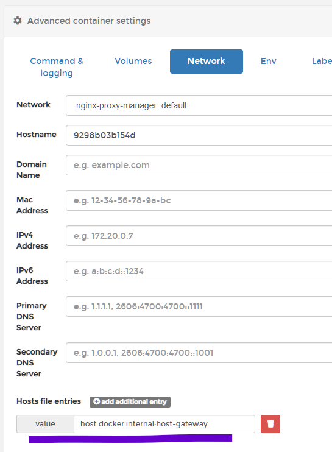

# Webhooks setup
Original project: https://github.com/adnanh/webhook
`sudo apt install webhook`

>Dockerised version: https://github.com/almir/docker-webhook
>Runs on port 9000 - can use NPM to reverse proxy this, however need to add an appropriate firewall rule otherwise the nginx container won't be able to access that service on the host localhost (see https://superuser.com/questions/1709013/enable-access-to-host-service-with-ubuntu-firewall-from-docker-container)
Check the network range for the nginx-proxy-manager_default network and then run a rule based on this on the host, e.g.
`sudo ufw allow from 172.19.0.0/16`
Then setup reverse proxy to the IP of the bridge network gateway (can confirm IP by looking at `ip addr show docker0` on the host) - normally should be 172.17.0.1.

>In theory if the container has been started with a `--add-host host.docker.internal:host-gateway` flag then you should be able to n use host.docker.internal instead, **however at present this doesn't work with NPM**. In Portainer go to advanced container settings > network and add `host.docker.internal:host-gateway` to the 'Hosts file entries'
>
> Ensure -verbose -hotreload tags used (for logging and ability to reload hooks without re-running container respectively)

Good guide at https://ansonvandoren.com/posts/deploy-hugo-from-github/

webhooks needs a hook file (which tells it how to handle incoming requests), and a script that it should run if it matches an incoming request

generate a v4 UUID to have as a 'secret' - https://www.uuidgenerator.net/

Create a webhooks directory in the home directory: `sudo mkdir /opt/webhook`
Then create a JSON file for the hooks: `sudo nano /opt/webhook/hooks.json` and set relevant trigger rules (such as the branch being pushed to):

??? example "/opt/webhook/hooks.json"
    ``` json linenums="1"
    --8<-- "docs/server-setup/hooks.json"
    ```

Now create a script: `nano /opt/webhook/triggerscript.sh` and then make it executable `chmod +x /opt/webhook/triggerscript.sh`
??? example "/opt/webhook/triggerscript.sh"
    ``` bash linenums="1"
    --8<-- "docs/server-setup/scripts/triggerscript.sh"
    ```

Create a service with `sudo nano /opt/webhook/webhooks.service`
```
# NOTES
# -----
# Install to systemd folder:
# sudo cp webhooks.service /etc/systemd/system/webhooks.service
# sudo systemctl daemon-reload
#
# Can then use:
# sudo systemctl enable webhooks --now
# sudo systemctl status webhooks
# sudo systemctl stop webhooks
#
[Unit]
Description=Webhook receiver service
ConditionPathExists=/usr/bin/webhook
After=network.target

[Service]
Type=simple
ExecStart=/usr/bin/webhook -hooks /opt/webhook/hooks.json -verbose -hotreload -port 9001
Restart=on-failure

[Install]
WantedBy=default.target
```
Enable and start the webhook service then check status (commands above)

### Telegram notifcation
See excellent guide at https://ansonvandoren.com/posts/telegram-notification-on-deploy/

Copy across trigger script.