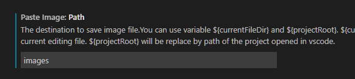

## Paste Image plugin
Install extension:
>Name: Paste Image

>Id: mushan.vscode-paste-image

>Description: paste image from clipboard directly

>Version: 1.0.4

>Publisher: mushan

>VS Marketplace Link: https://marketplace.visualstudio.com/items?itemName=mushan.vscode-paste-image

Set `Paste Image: path` to `images` so they go into a subdirectory:
